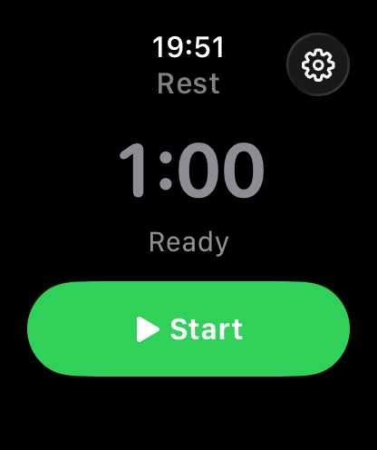
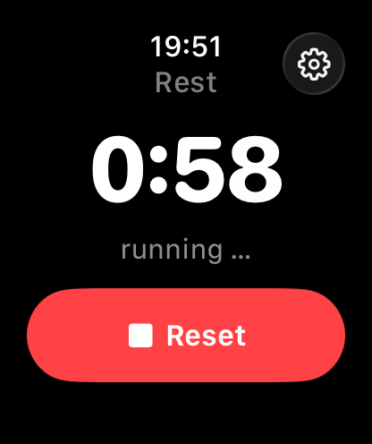
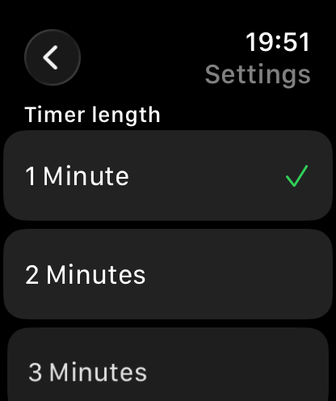
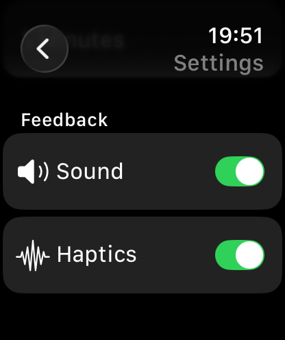

# 🏋️ Gym Timer — Apple Watch Rest Timer

A minimal, focused **Apple Watch** app that times the rest periods between
your training sets. Built with **SwiftUI** and **WatchKit**.

The app stays in the foreground the entire time your countdown is running,
ticks during the final seconds, and gives you a clear haptic signal when
your rest is over — so you can keep your phone in your pocket and focus on
the next set.

---

## ✨ Features

- ⏱️ **Rest countdown** for gym sets
- ⚙️ **Configurable duration** — 1, 2 or 3 minutes
- ▶️ **Start button** to begin the countdown
- 🔢 **Large, animated countdown display** (turns red in the last 5 seconds)
- 📳 **Tick-tick-tick haptics** during the final 5 seconds *(toggleable)*
- 🔊 **Tick sound + end chime** during the final 5 seconds *(toggleable)*
- 🔔 **End signal** — notification + success haptic when the timer ends
- ⏹️ **Reset button** while the timer runs — cancels the countdown and returns to the start screen
- 🔄 **Auto-return to Start** once the timer reaches `0:00`
- 📱 **Always foreground** — uses `WKExtendedRuntimeSession` (`.physicalTherapy`) so the screen and app stay active for the full rest period
- 🌍 **Localized** in **English** and **German** (follows the watch's system language)

---

## 📸 Screenshots

| Idle / Ready | Countdown running | Timer Settings | Feedback Settings | 
| :---: | :---: | :---: | :---: |
|  |  |  |  |

---

## 🧱 Project Structure

```
gym-timer Watch App/
├── gym_timerApp.swift     # App entry point
├── ContentView.swift        # NavigationStack wrapper
├── TimerView.swift          # Main UI: Start / Reset / countdown display
├── TimerViewModel.swift     # Countdown logic, haptics & runtime session
├── SettingsView.swift       # Duration picker + Sound/Haptics toggles
├── AppSettings.swift        # UserDefaults keys & default values
├── SoundPlayer.swift        # AVAudioPlayer wrapper for tick/end sounds
├── Localizable.xcstrings    # String Catalog (EN + DE)
├── Resources/
│   ├── tick.wav             # Short click for the last-5-seconds ticks
│   └── end.wav              # End-of-rest chime
└── Assets.xcassets/
```

### Key components

| File | Responsibility |
| --- | --- |
| `TimerViewModel.swift` | Drives the countdown via a `Timer`, plays tick haptics in the final 5 s, fires the end haptic, and manages a `WKExtendedRuntimeSession` of type `.physicalTherapy` to keep the app in the foreground. |
| `TimerView.swift` | Renders either the **idle state** (Start button + selected duration) or the **running state** (animated countdown + Reset button). |
| `SettingsView.swift` | Lets the user pick 1, 2 or 3 minutes; the choice is persisted with `@AppStorage`. |

---

## 🛠️ Requirements

- macOS with **Xcode 15** or later
- **watchOS 10** or later
- An Apple Watch or the watchOS Simulator

## 🚀 Build & Run

1. Clone the repository
   ```bash
   git clone https://github.com/<your-user>/gym-timer.git
   cd gym-timer
   ```
2. Open the project in Xcode
   ```bash
   open gym-timer.xcodeproj
   ```
3. Select the **`gym-timer Watch App`** scheme.
4. Choose an Apple Watch simulator (or your paired device).
5. Press **▶ Run** (`⌘R`).

> 💡 The project uses `PBXFileSystemSynchronizedRootGroup`, so any Swift
> file you add inside `gym-timer Watch App/` is automatically picked up
> by the watch target — no manual file references needed.

---

## 🎯 Usage

1. Open the app on your watch.
2. Tap the ⚙️ gear icon in the top-right to set your rest duration
   (**1**, **2** or **3 minutes**).
3. Tap the green **Start** button to begin the rest countdown.
4. While the timer runs:
   - The screen stays on and the app stays in the foreground.
   - In the **last 5 seconds**, you'll feel a tick every second.
   - At **0:00**, a notification haptic + success haptic fires.
   - Tap the red **Reset** button at any time to cancel and return to Start.
5. After the timer ends, the **Start** button reappears — ready for your next set.

---

## ⚙️ How "always in foreground" works

The app starts a `WKExtendedRuntimeSession` of type `.physicalTherapy`
when the countdown begins and invalidates it when the countdown ends or
is reset. This session type is intended for short fitness/therapy
workflows and allows the app to keep running with the screen visible —
perfect for gym rest periods of up to 3 minutes.

---

## 📄 License

MIT — feel free to use, modify and share.
